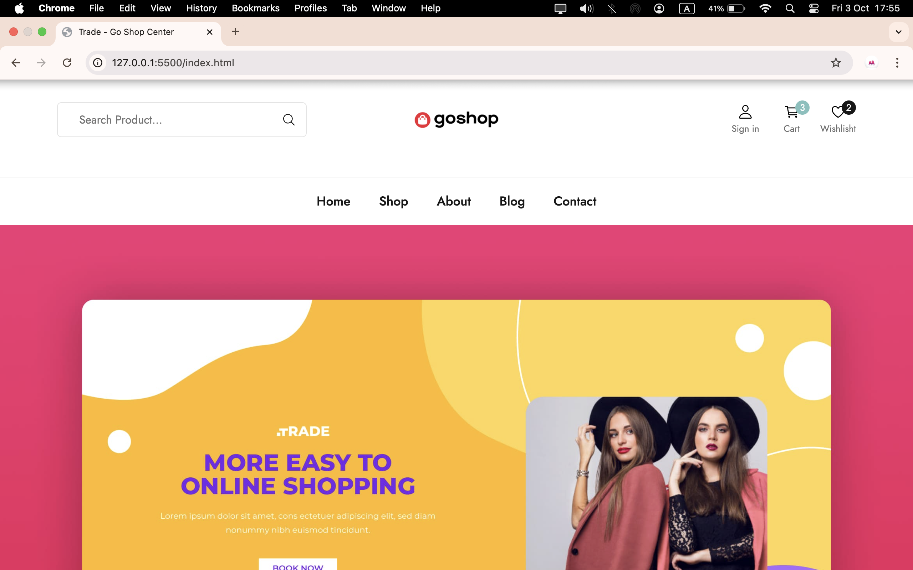
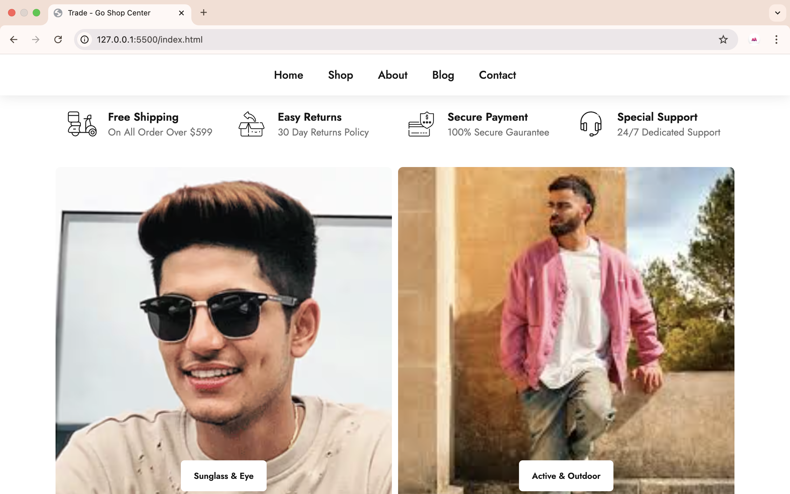
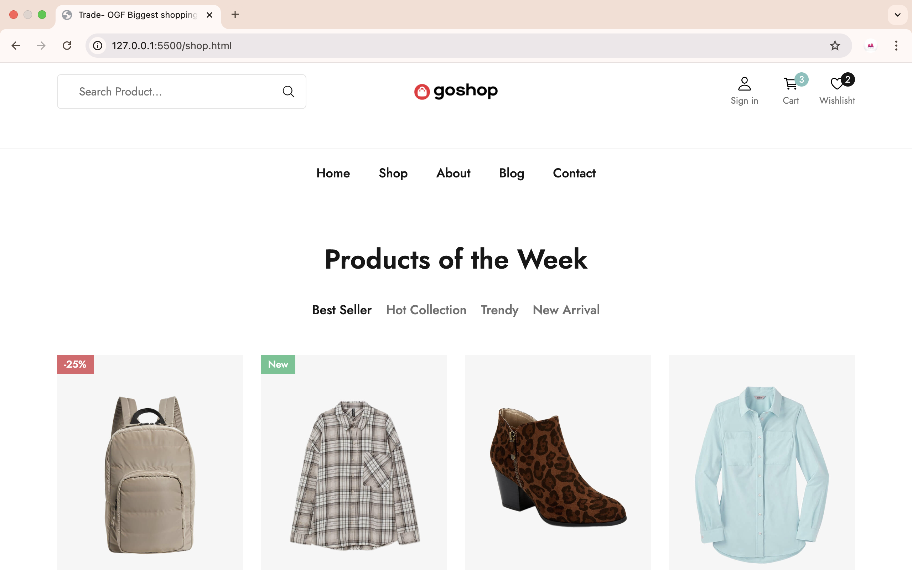
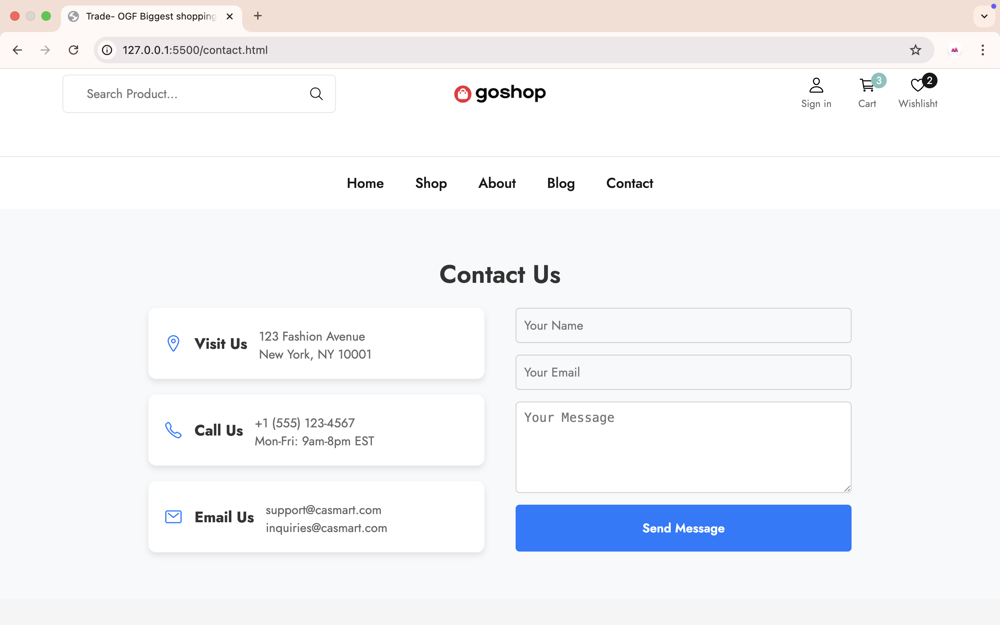

# Go Shop Center

A modern, responsive e-commerce website template.

---

## 🌟 Features
- 🛒 Modern UI/UX
- 📱 Responsive design for all devices
- 🔒 Secure payment section
- 🌐 Ready for internationalization
- ⚡ Fast and lightweight

## 📸 Screenshots


## 🛠️ Tech Stack
- HTML5, CSS3, JavaScript
- [Ionicons](https://ionic.io/ionicons)

## 🚀 Getting Started

1. **Clone or Download**
   ```bash
   git clone https://github.com/YOUR-USERNAME/go-shop-center.git
   cd go-shop-center
   ```
2. **Open `index.html` in your browser**

## 🤝 Contributing
Contributions are welcome! Please see [CONTRIBUTING.md](CONTRIBUTING.md) for guidelines.

## 📄 License
This project is licensed under the [MIT License](LICENSE).

---

## 🌏 日本語

Go Shop Centerは、現代的なUI/UXを備えたレスポンシブなECサイトテンプレートです。
日本のIT企業にも最適です。

### 特徴
- モダンなデザイン
- レスポンシブ対応
- セキュアな決済セクション
- 国際化対応

### セットアップ方法
1. このリポジトリをクローンまたはダウンロード
2. `index.html` をブラウザで開く

---

## 📬 Contact
For business inquiries, please contact:
**English:** [afasahamed077@gmail.com]
**日本語:** [afasahamed077@gmail.com]

---




